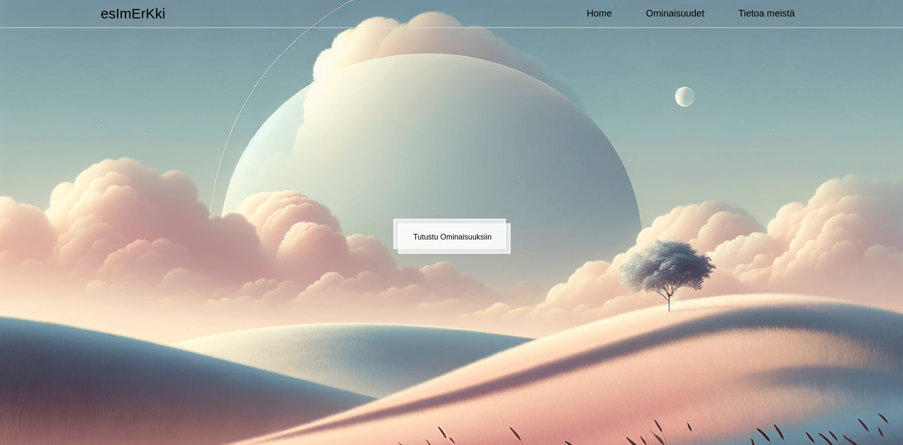
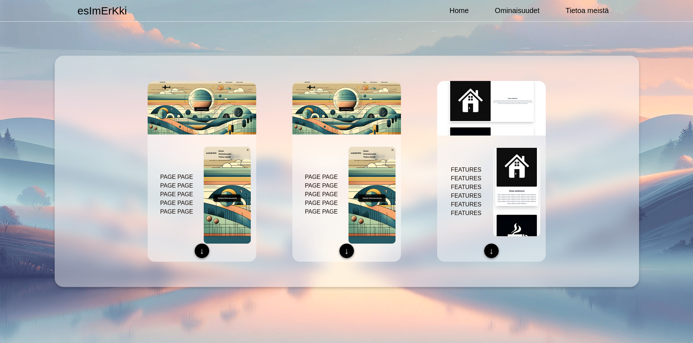

# agileinc Animation Cards Website

This project represents a step forward in my exploration of Tailwind CSS, focusing on animations and interactive elements. The website features a series of animated cards that showcase my ability to integrate motion within web interfaces effectively.

## Features

- **Tailwind CSS for Styling**: Utilizing Tailwind CSS for styling the website and ensuring responsiveness across devices.
- **Interactive Card Stacks**: The website includes card stacks that users can interact with, showcasing different features or portfolio pieces.
- **Animation**: Leveraging CSS animations to enhance the user experience, with cards that animate in and out of the stack on user interaction.
- **Responsive Design**: Ensuring the website is fully responsive, making it accessible on both desktop and mobile devices.

## Getting Started

To experience the eSimeRkkI Animation Cards website, visit the live version hosted on Cloudflare Pages at https://agileinc.pages.dev/

# agileinc Animaatiokorttien Verkkosivusto

Tämä projekti edustaa askelta eteenpäin Tailwind CSS:n tutkimisessani, keskittyen animaatioihin ja interaktiivisiin elementteihin. Verkkosivusto sisältää joukon animoituja kortteja, jotka esittelevät kykyäni integroida liike verkkokäyttöliittymiin tehokkaasti.

## Ominaisuudet

- **Tailwind CSS tyylittelyyn**: Käyttää Tailwind CSS:ää verkkosivuston tyylittelyyn ja varmistaa responsiivisuuden eri laitteilla.
- **Interaktiiviset Korttipinot**: Sivusto sisältää korttipinoja, joilla käyttäjät voivat olla vuorovaikutuksessa, esitellen erilaisia ominaisuuksia tai portfoliokappaleita.
- **Animaatio**: Hyödyntää CSS-animaatioita käyttökokemuksen parantamiseen, kortit animoivat sisään ja ulos pinosta käyttäjän vuorovaikutuksen yhteydessä.
- **Responsiivinen Suunnittelu**: Varmistaa, että verkkosivusto on täysin responsiivinen, tehden sen käytettäväksi sekä työpöytä- että mobiililaitteilla.

## Aloittaminen

Kokeaksesi eSimeRkkI Animaatiokortit -verkkosivuston, vieraile live-versiossa, joka on isännöity Cloudflare Pages osoitteessa https://agileinc.pages.dev/

